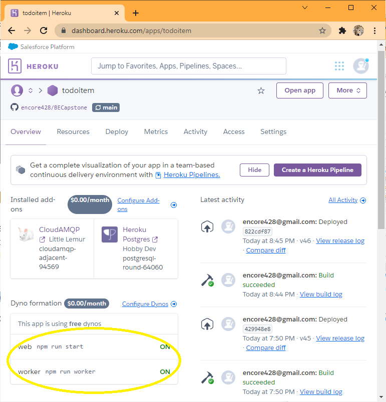

# Event-driven access control update on RabbitMQ

**Functionality Implementation Approach**

- The application has built a set of `/actls/{tid}` endpoints to accept and perform access control updates.  That
  update is immediate.
- To enable event-driven approach, another set of endpoints `/actlq/{tid}` is added.  Both sets have the same validaiton,
  function, and syntax.
- For all validation rules that can be executed without referring to the database, both `/actls/{tid}` and `/actlq/{tid}` 
  behave exactly the same.
- Once pre-database validation is completed, `/actls/{tid}` invokes `db.updateActls()` and receives the result to send back 
  as API response.  `/actlq/{tid}` instead will invoke `service.publishActlq()` to en-queue the request and send back 202 
  as API response.
- `worker` process consumes the request reading from the queue, and invokes the same `db.updateActls()` to process
  the request, and `console.log` the result.
- `db.updateActls()` first performs secondary validation against the database, returns an error message if the 
  validation fails.  If validation is successful, it proceeds to udpate, and return the result.

# Application Changes Explained

**Modify  `package.json`**

Add `"amqplib": "^0.8.0",",` to depedencies so as to add MQ functionality to the application:
```
  "dependencies": {
    "amqplib": "^0.8.0",
	...
  },
```
In practice, the above is actually effected with `npm install amqplib`.

**New program `src/services/amqp.js`**

To implement method `service.publishActlq(actl, auid, email, reqType)`.  This is one of two places where `amqplib` is used:
```js
const amqplib = require('amqplib')
```  

It exposes it's `service.publishActlq` method.  This method is called by `src/routes/actlq.js` to enqueue access control 
update requests.
```js
module.exports = () => {
...
  service.publishActlq = async (actl, auid, email, reqType) => {
    ...
    const result = await channel.sendToQueue(
      QUEUE,
      ...
    )
    ...	
  }
  ...
  return service
}
```

Also note these two lines that expect the name of the queue to be present in the env file.
```js
require('dotenv').config()
...
const QUEUE = process.env.ACTL_QUEUE || 'actlq'
```  

**New program `src/worker.js`**

To implement a worker process to consume messages from the queue.  This is the other place where `ampqlib` is used:
```js
const amqplib = require('amqplib')
```  
Each message is a request to perform update to access control.  This program invokes `db.updateActl()` (the same method used 
by `/actls/{tid}` to perform instant update) to perform the update, and `console.log` the result.  It therefore
is necessary that the program also requires `('/db')`.
```js
...
const db = require('./db')
...
async function main () {
...
  channel.consume(QUEUE, async (msg) => {
    const data = JSON.parse(msg.content)
    const actl = await db.updateActl(data.actl, data.auid, data.email, data.reqType)
...
  })
}
```
Similar to `src/services/amqp.js`, these two lines expect the name of the queue to be present in the env file.
```js
require('dotenv').config()
...
const QUEUE = process.env.ACTL_QUEUE || 'actlq'
```  

  
**Modify `src/server.js` and `tests/utils.js`**

Add these lines to bring in the services rendered by `src/services/amqp.js`:
```
const AmqpService = require('./services/amqp')  // for utils.js, it is ('../src/services/amqp')
const amqpService = AmqpService()
```
Anclude `amqpService` in `router`, so as to make it's services available to endpoints that need them.
```
const router = Router(authMiddleware, authService, amqpService, db)
```

**Modify `src/routes/index.js`**

To accept `amqpService` by adding it to the argument list:
```js
module.exports = (authMiddleware, authService, amqpService, db) => {

```
Add new endpoint `/actlq/{tid}`, and pass to it access to `amqpService` by adding this line: 
```js
  router.use('/actlq', require('./actlq')(amqpService))
```

**New program `src/routes/actlq.js`**

This program is modeled from `src/routes/actls.js`.   The difference being that `/actlq` is used in the url instead 
of `/actls`, and that `src/routes/actlq.js` invokes `service.publishActlq()` to enqueue the request instead 
of `src/routes/actls.js`'s invoking `db.updateActl()` to perform the update inline.
```js
const express = require('express')
...
module.exports = (amqpService) => {
...
  router.post('/:id', async (req, res, next) => {
...
  }
  router.put('/:id', async (req, res, next) => {
...
  }
  router.delete('/:id', async (req, res, next) => {
...
  }
  return router
}
```
Note that unlike other endpoints with `db` in `module.exports = (db) => {`, this endpoint uses `amqpService` because it does
not access the database service to perform table updates, but access the message queue to enqueue requests.

**Modify `.env` and `env.test`**

Add an entry for the name of the message queue for access control requests.  This queue name could have been hardcoded, 
but intead was made to be Config Var in the two programs that need the name of the queue: `src/services/amqp.js` 
  to enqueue requests, and `src/worker.js` to consume.
```js
ACTL_QUEUE=actlq
```

**Modify `package.json`**

Add `"worker": "node src/worker.js",` to scripts, so that the worker process can be started with the command `npm run worker`:
```
  "scripts": {
    ...
    "worker": "node src/worker.js",
    ...
  },
```

**Modify `Procfile`**

Add the following so heroku knows that there is a worker process and how it is started:
```
worker: npm run worker
```  

**New Testing program `src/routes/actlq.test.js`**

This program is almost identical to `src/routes/actls.test.js`.  The difference being that since the update is delayed:
1. All validation failure test cases that do not require database reference are replicated and behave exactly the same.
1. All validation failure test cases that require database referece are replicated.  But instead of immediate rejection, 
   the request is enqueued, and the response to API is always 202.  These cases are included beause no database 
   update will take place, and therefore the result of any one does not affect anohter.
1. All validation success with database updating test cases are excluded except for three POST requests.
1. The rest of the test should be conducted manually using postman.

# Local Deployment

**Rabbit MQ**

Start a docker container to deploy rabbit mq with:
```bash
docker run -it -d --rm --name rabbitmq -p 5672:5672 -p 15672:15672 rabbitmq:3-management
```
To monitor RabbitMQ, go to http://localhost:15672/

Start the worker process.  The console.log from the worker are shown here.
```bash
npm run worker
```

Start the app:
```bash
npm start
```

# Heroku Deployment

Add resource CloudAMQP, pick Little Lemur plan.

Two new Config Vars will be added: `CLOUDAMQP_APIKEY`, and `CLOUDAMQP_URL`.

The line `worker: npm run worker` in `Procfile` will add one more Dyno in the application Overview.  Configure to 
turn on that Dyno at heroku console.



Output from the worker can be viewed at `View logs`.

